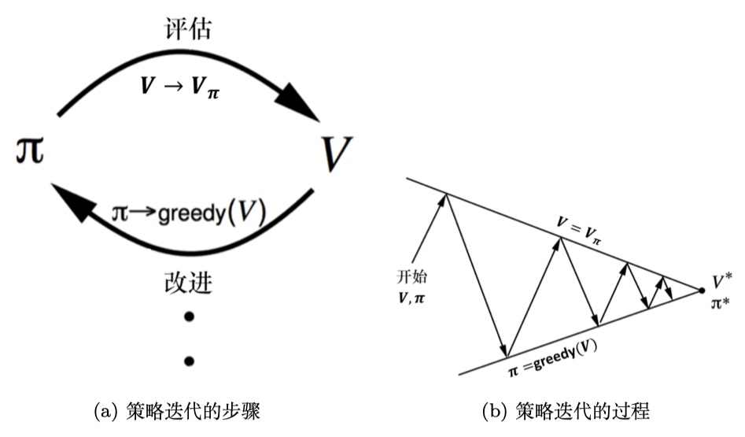

# 马尔可夫决策过程

## 马尔可夫性质

未来状态仅依赖于当前状态

$$
p\left(X_{t+1}=x_{t+1} \mid X_{0:t}=x_{0: t}\right)=p\left(X_{t+1}=x_{t+1} \mid X_{t}=x_{t}\right)
$$

$$
  p\left(s_{t+1} \mid s_{t}\right) =p\left(s_{t+1} \mid h_{t}\right) 
$$

$$
h_{t}=\left\{s_{1},s_{2},s_{3},\ldots,s_{t}\right\}
$$

$$
p\left(s_{t+1}=s^{\prime} \mid s_{t}=s\right)
$$

$$
  \boldsymbol{P}=\left(\begin{array}{cccc}
    p\left(s_{1} \mid s_{1}\right) & p\left(s_{2} \mid s_{1}\right) & \ldots & p\left(s_{N} \mid s_{1}\right) \\
    p\left(s_{1} \mid s_{2}\right) & p\left(s_{2} \mid s_{2}\right) & \ldots & p\left(s_{N} \mid s_{2}\right) \\
    \vdots & \vdots & \ddots & \vdots \\
    p\left(s_{1} \mid s_{N}\right) & p\left(s_{2} \mid s_{N}\right) & \ldots & p\left(s_{N} \mid s_{N}\right)
    \end{array}\right)
$$

---

## 马尔可夫奖励过程

马尔科夫链加上奖励函数，奖励函数 $R$ 是一个期望，表示当我们到达某个状态时可以获得多大大的奖励，还有折扣因子 $\gamma$ ，如果状态数有限，那么 $R$ 可以是一个向量。

### 回报函数

假设 $t$ 时刻后的奖励序列为 $r_{t+1},r_{t+2},r_{t+3},\ldots$

$$
  G_{t}=r_{t+1}+\gamma r_{t+2}+\gamma^{2} r_{t+3}+\gamma^{3} r_{t+4}+\ldots+\gamma^{T-t-1} r_{T}
$$

### 状态价值函数

对于马尔可夫奖励过程，状态价值函数被定义为回报的期望

$$
\begin{aligned}
    V^{t}(s) &=\mathbb{E}\left[G_{t} \mid s_{t}=s\right] \\
    &=\mathbb{E}\left[r_{t+1}+\gamma r_{t+2}+\gamma^{2} r_{t+3}+\ldots+\gamma^{T-t-1} r_{T} \mid s_{t}=s\right]
\end{aligned}  
$$

$r_{t+1},r_{t+2},r_{t+3},\ldots$ 就是时刻t后的一条轨迹， $r_{t+1}$ 是进入状态 $s$ 得到的奖励。期望可以对这个轨迹采样，即蒙特卡洛的方法计算

### 贝尔曼方程

可以从状态价值函数 $V^{t}(s)$ 中推导。

$$
V(s)=\underbrace{R(s)}_{\text{即时奖励}}+\underbrace{\gamma \sum_{s^{\prime} \in S}p(s^{\prime} \mid s)V(s^{\prime})}_{\text{未来奖励的总和}}
$$

* $s^{\prime}$ 可看作未来的所有状态
* $p(s^{\prime} \mid s)$ 状态转移概率
* $V(s^{\prime})$ 未来某一状态的价值
* $\gamma \sum_{s^{\prime} \in S}p(s^{\prime} \mid s)V(s^{\prime})$ 未来奖励的折扣总和

**推导**

$$
\begin{aligned}
\mathbb{E}[V(s_{t+1} \mid s_{t})] 
&=\mathbb{E}[\mathbb{E}[G_{t+1} \mid s_{t+1}] \mid s_{t}]\underbrace{=}_{\text 全期望公式推导}\mathbb{E}[G_{t+1} \mid s_{t}]\\
V(s)
&=\mathbb{E}[G_{t}\mid s_{t}=s] \\
&=\mathbb{E}[r_{t+1}+\gamma G_{t+1} \mid s_{t}=s] \\
&=R(s)+\gamma \mathbb{E}[G_{t+1}\mid s_{t}=s] \\
&=R(s)+\gamma \mathbb{E}[V(s_{t+1}) \mid s_{t}=s] \\
&=R(s)+\gamma \sum_{s^{\prime}\sim S}p(s^{\prime}\mid s)V(s^{\prime})
\end{aligned}
$$

假设状态空间 $S=\left \{s_{1},s_{2},s_{3},\ldots,s_{N}\right \}$ .    

把贝尔曼方程写成矩阵的形式

$$
  \left(\begin{array}{c}
    V\left(s_{1}\right) \\
    V\left(s_{2}\right) \\
    \vdots \\
    V\left(s_{N}\right)
    \end{array}\right)=\left(\begin{array}{c}
    R\left(s_{1}\right) \\
    R\left(s_{2}\right) \\
    \vdots \\
    R\left(s_{N}\right)
    \end{array}\right)+\gamma\left(\begin{array}{cccc}
    p\left(s_{1} \mid s_{1}\right) & p\left(s_{2} \mid s_{1}\right) & \ldots & p\left(s_{N} \mid s_{1}\right) \\
    p\left(s_{1} \mid s_{2}\right) & p\left(s_{2} \mid s_{2}\right) & \ldots & p\left(s_{N} \mid s_{2}\right) \\
    \vdots & \vdots & \ddots & \vdots \\
    p\left(s_{1} \mid s_{N}\right) & p\left(s_{2} \mid s_{N}\right) & \ldots & p\left(s_{N} \mid s_{N}\right)
    \end{array}\right)\left(\begin{array}{c}
    V\left(s_{1}\right) \\
    V\left(s_{2}\right) \\
    \vdots \\
    V\left(s_{N}\right)
    \end{array}\right) 
$$

可以直接求解

$$
\begin{aligned}
\boldsymbol V &= \boldsymbol R +\gamma \boldsymbol P \boldsymbol V \\
\boldsymbol I \boldsymbol V &=\boldsymbol R+\gamma \boldsymbol P \boldsymbol V \\
(\boldsymbol I-\gamma \boldsymbol P)\boldsymbol V &=\boldsymbol R \\
\boldsymbol V &= (\boldsymbol I-\gamma \boldsymbol P)^{-1}\boldsymbol R
\end{aligned}
$$

这个矩阵求逆的复杂度 $O(N^3)$ ，只适合用于状态空间较少的情况。

### 动态规划方法

迭代贝尔曼方程

1: 对于所有状态 $s \in S$ ，$V'(s) \leftarrow 0$，$V(s) \leftarrow \infty$  
2: 当 $\| V - V' \| > \epsilon$ 执行  
3: $\quad V \leftarrow V'$  
4: $\quad$ 对于所有状态 $s \in S$，$V'(s) = R(s) + \gamma \sum_{s' \in S} P(s'|s) V(s')$  
5: 结束循环  
6: 返回 $V'(s)$，对于所有状态 $s \in S$  

----

## 马尔可夫决策过程

### 状态转移

$$
p(s_{t+1}=s^{\prime} \mid s_{t}=s,a_{t}=a)
$$

### 即时奖励

$$
R(s_{t}=s,a_{t}=a)=\mathbb E[r_{t} \mid s_{t}=s,a_{t}=a]
$$

当前的状态以及采取的动作会决定智能体在当前可能得到的奖励。

### 策略

$$
\begin{aligned}
\pi(a \mid s)&=p(a_{t}=a \mid s_{t}=s) \\
P_{\pi}(s^{\prime} \mid s)&=\sum_{a \in A}\pi(a \mid s)p(s^{\prime} \mid s,a) \\
r_{\pi}(s)&=\sum_{a \in A}\pi(a \mid s)R(s,a)
\end{aligned}
$$

### 价值函数

$$
\begin{aligned}
V_{\pi}(s)
&=\mathbb{E}_{\pi}[G_{t} \mid s_{t}=s] \\
&=\underbrace{\mathbb{E}_{\pi}[r_{t+1}+\gamma V_{\pi}(s_{t+1}) \mid s_{t}=s]}_{\text{贝尔曼期望方程}}                   \\
Q_{\pi}(s,a)
&=\mathbb{E}_{\pi}[G_{t} \mid s_{t}=s,a_{t}=a] \\
&=\underbrace{\mathbb{E}_{\pi}[r_{t+1}+\gamma Q_{\pi}(s_{t+1},a_{t+1}) \mid s_{t}=s,a_{t}=a]}_{\text{贝尔曼期望方程}}       \\
V_{\pi}(s)
&=\sum_{a \in A}\pi(a \mid s)Q_{\pi}(s,a) \\
&=\underbrace{\sum_{a \in A}\pi(a \mid s)\left(R(s,a)+\gamma\sum_{s^{\prime} \in S}p(s^{\prime} \mid s,a)V_{\pi}(s^{\prime})\right)}_{\text{贝尔曼期望方程}}                  \\
Q_{\pi}(s,a)
&=R(s,a)+\gamma\sum_{s^{\prime} \in S}p(s^{\prime} \mid s,a)V_{\pi}(s^{\prime})\\
&=\underbrace{R(s,a)+\gamma\sum_{s^{\prime} \in S}p(s^{\prime} \mid s,a)\left(\sum_{a^{\prime} \in A}\pi(a^{\prime} \mid s^{\prime})Q_{\pi}(s^{\prime},a^{\prime})\right)}_{\text{贝尔曼期望方程}}   \\ 
\end{aligned}
$$

$Q$ 函数贝尔曼方程推导同理

### 备份图

其实就是俩个贝尔曼方程的计算

  

  

----

## 预测与控制

* 预测：输入马尔可夫决策过程 $<S,A,P,R,\gamma>$ 和策略 $\pi$ 输出价值函数 $V_{\pi}$
* 控制:输入时马尔可夫决策过程 $<S,A,P,R,\gamma>$ 输出最佳价值函数 $V^*$ 和最佳策略 $\pi^*$ .

### 策略评估

即预测,通过贝尔曼期望备份实现，反复迭代直到收敛

$$
\begin{aligned}
V^{t+1}(s)
&=\sum_{a \in A}\pi(a \mid s)\left(R(s,a)+\gamma \sum_{s^{\prime} \in S}p(s^{\prime} \mid s,a)V^{t}(s^{\prime})\right) \\
V^{t+1}(s)&=r_{\pi}(s)+\gamma P_{\pi}(s^{\prime} \mid s)V^{t}(s^{\prime})
\end{aligned}
$$

### 过程控制

只有马尔可夫决策过程，如何寻找最佳策略，从而得到最佳价值函数

### 最佳价值函数与最佳策略

$$
\begin{aligned}
V^{*}(s)&=\max _{\pi} V_{\pi}(s) \\
\pi ^{*}(s)&=\arg \max _{\pi} V_{\pi}(s)
\end{aligned}
$$

当取得最佳价值函数后，可以通过对Q函数最大化得到最佳策略

$$
\pi^*(a \mid s) = 
\begin{cases} 
1, & a = \arg\max _{a \in A} Q^*(s, a) \\
0, & \text{其他}
\end{cases}
$$

## 策略搜索方法

* 穷举，$S$ 空间，$A$ 动作，$\mid A \mid^{\mid S \mid}$ 个策略
* 策略迭代,首先进行策略评估，得出状态价值函数，再进行策略改进，即对Q函数最大化，不断重复这俩步
* 价值迭代，直接使用贝尔曼最优方程进行迭代，找到最佳价值函数，最后再提取最佳策略

### 策略迭代

  

* 策略评估：对于策略 $\pi$ ，计算状态价值函数,这里下面是迭代计算的该策略下的状态价值函数

$$
\begin{aligned}
V^{t+1}(s)
&=\sum_{a \in A}\pi(a \mid s)\left(R(s,a)+\gamma \sum_{s^{\prime} \in S}p(s^{\prime} \mid s,a)V^{t}(s^{\prime})\right) \\
V^{t+1}(s)&=r_{\pi}(s)+\gamma P_{\pi}(s^{\prime} \mid s)V^{t}(s^{\prime}) \\
V_{\pi_{i}}(s)&=V^{t+1}(s)
\end{aligned}
$$

* 策略改进:由状态价值函数推算 $Q$ 函数，然后对Q函数最大化，通过对 $Q$ 函数做一个贪心的搜索来改进策略

$$
\begin{aligned}
Q_{\pi_{i}}(s,a)&=R(s,a)+\gamma \sum_{s^{\prime} \in S}p(s^{\prime} \mid s,a)V_{\pi_{i}}(s^{\prime}) \\
\pi_{i+1}(s)&=\arg \max _{a} Q_{\pi_{i}}(s,a)
\end{aligned}
$$

当我们一直做 $\arg \max$ 操作，我们会得到更好或者不变的策略，不会使价值函数变差。当整个状态收敛，最佳价值函数也就等于这个状态下采取最好行动得到的回报的期望。此时满足**贝尔曼最优方程**。

$$
\begin{aligned}
V_{\pi}(s)
&=\max_{a \in A}Q_{\pi}(s,a) \\
V^{*}(s)
&=\max_{a \in A}Q^{*}(s,a) \\
Q^{*}(s,a)
&=R(s,a)+\gamma \sum_{s^{\prime} \in S}p(s^{\prime} \mid s,a)V^{*}(s^{\prime})
\end{aligned}
$$

上面的公式可以互相带入得到 $Q$ **函数转移公式**和**状态价值转移公式**

### 价值迭代

贝尔曼最优方程迭代-确认性价值迭代

$$
V(s)\leftarrow \max_{a \in A}\left(R(s,a)+\gamma \sum_{s^{\prime} \in S}p(s^{\prime} \mid s,a)V(s^{\prime})\right)
$$

价值迭代算法的过程如下。

（1）初始化：令 $k=0$，对于所有状态 $s$，$V_0(s)=0$。

（2）对于 $k=1:H$ （ $H$ 是让 $V(s)$ 收敛所需的迭代次数）

&ensp;&ensp;&ensp;&ensp;（a）对于所有状态 $s$

$$
Q_{k+1}(s, a)=R(s, a)+\gamma \sum_{s^{\prime} \in S} p\left(s^{\prime} \mid s, a\right) V_{k}\left(s^{\prime}\right) 
$$

$$
V_{k+1}(s)=\max _{a} Q_{k+1}(s, a) 
$$

&ensp;&ensp;&ensp;&ensp;（b）$k \leftarrow k+1$。

（3）在迭代后提取最优策略：

$$
\pi(s)=\underset{a}{\arg \max } \left[R(s, a)+\gamma \sum_{s^{\prime} \in S} p\left(s^{\prime} \mid s, a\right) V_{H+1}\left(s^{\prime}\right)\right]
$$

  

