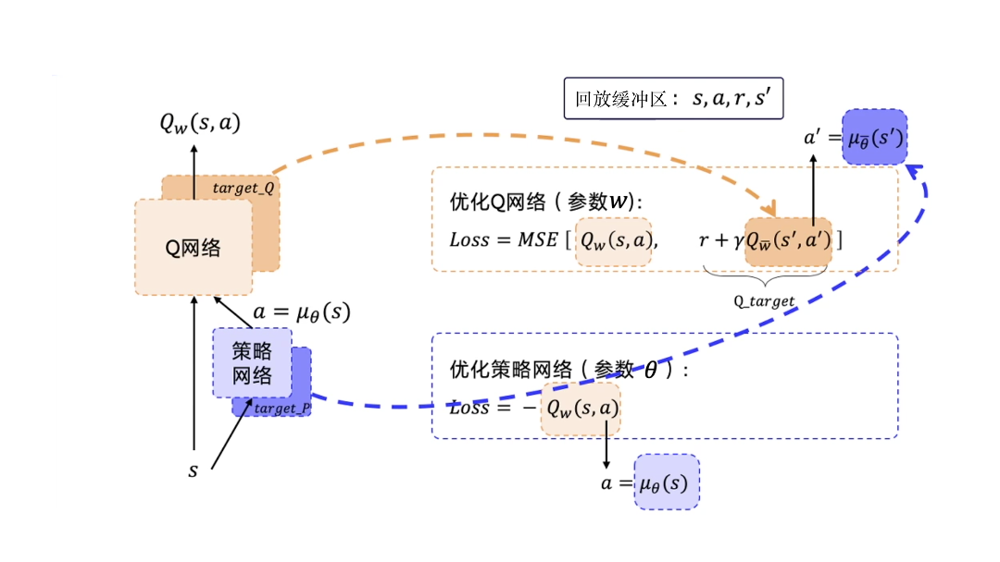

# 深度确定性策略 

同样是为连续动作设计,个人认为这个和演员评论员算法章节中的路径衍生策略梯度是一样的，所以第一个DDPG不做过多阐述。

## DDPG

我在[OPENAI-RL](https://spinningup.openai.com/en/latest/algorithms/ddpg.html)中也看了对DDPG的描述，其实就是前面提到的[路径衍生策略梯度](8.演员评论员算法.md)

## 双延迟深度确定性策略梯度(Twin Delayed DDPG)TD3

DDPG 也会高估了 $Q$ 值

TD3引入三个技巧解决这个问题：

* **双 $Q$ 学习**，学习俩个 $Q$ 函数 $$ $$ ，并使用同一个目标,两个Q函数中给出的较小的值会被作为如下的 Q-target：

$$
y\left(r, s^{\prime}, d\right)=r+\gamma(1-d) \min _{i=1,2} Q_{\phi_{i, \text{targ}}}\left(s^{\prime}, a_\text{TD3}\left(s^{\prime}\right)\right)
$$

* **延迟的策略更新**：以较低频率更新动作网络，较高频率更新评价网络，比如频率2：1

* **目标策略平滑**：TD3在目标动作中加入噪声，通过平滑 $Q$ 沿动作的变化，使策略更难利用 $Q$ 函数的误差。

$$
a_\text{TD3}\left(s^{\prime}\right)=\operatorname{clip}\left(\mu_{\theta, \text{targ}}\left(s^{\prime}\right)+\operatorname{clip}(\epsilon,-c, c), a_{\text {low }}, a_{\text {high }}\right)
$$

[OPENAI-RL](https://spinningup.openai.com/en/latest/algorithms/ddpg.html)给出的伪代码

