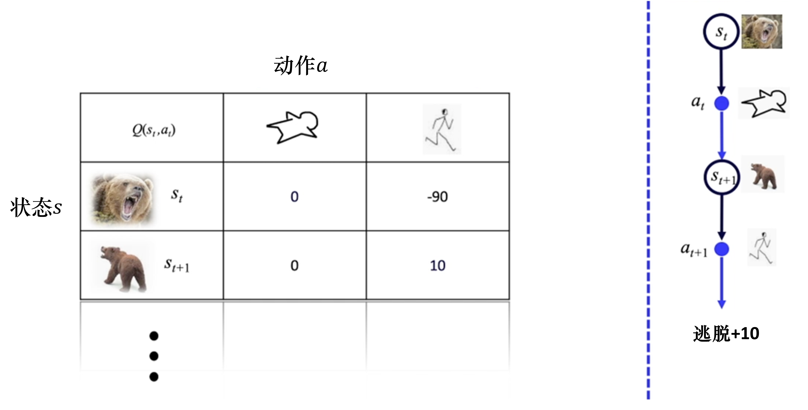
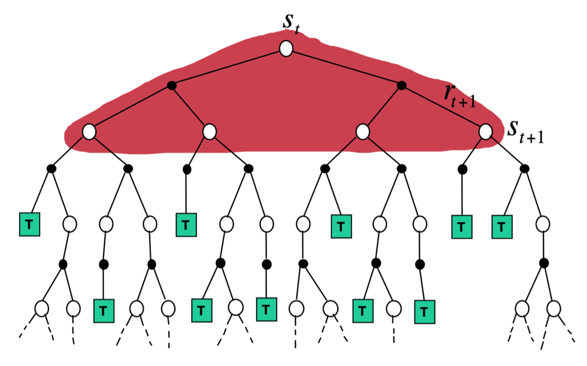
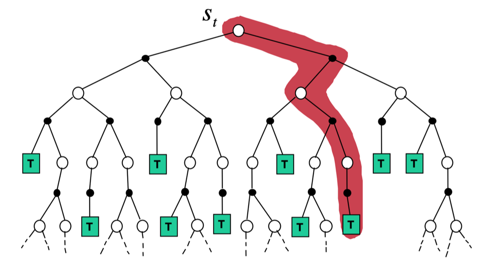
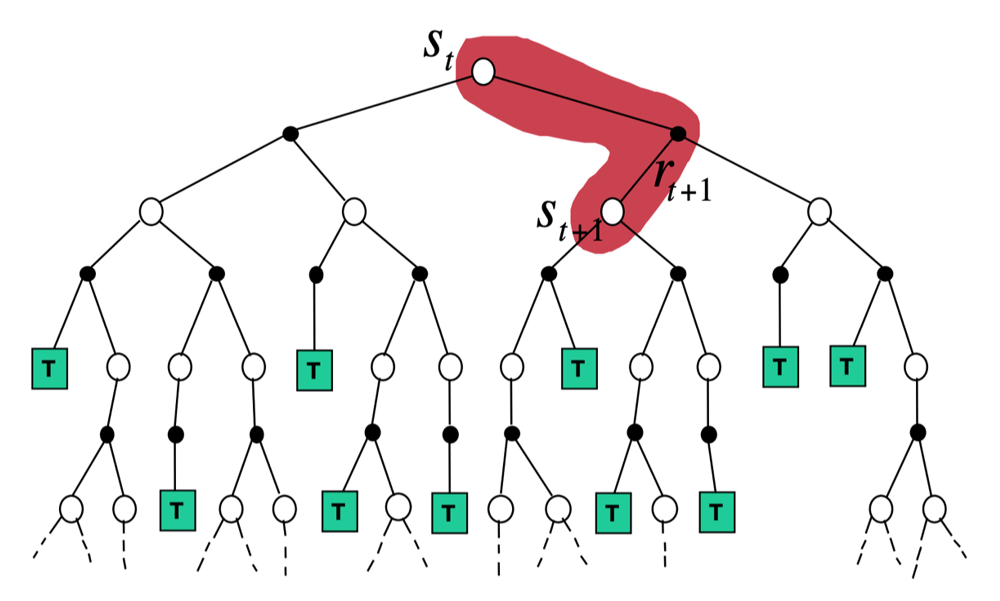
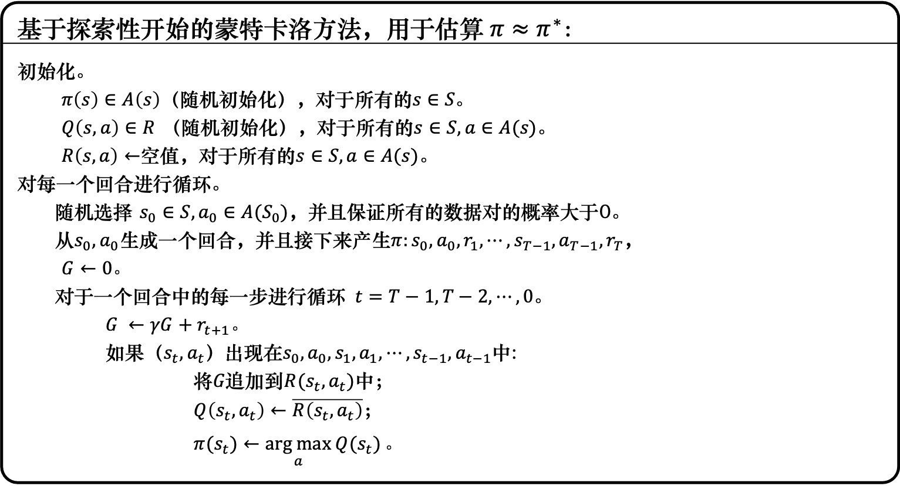
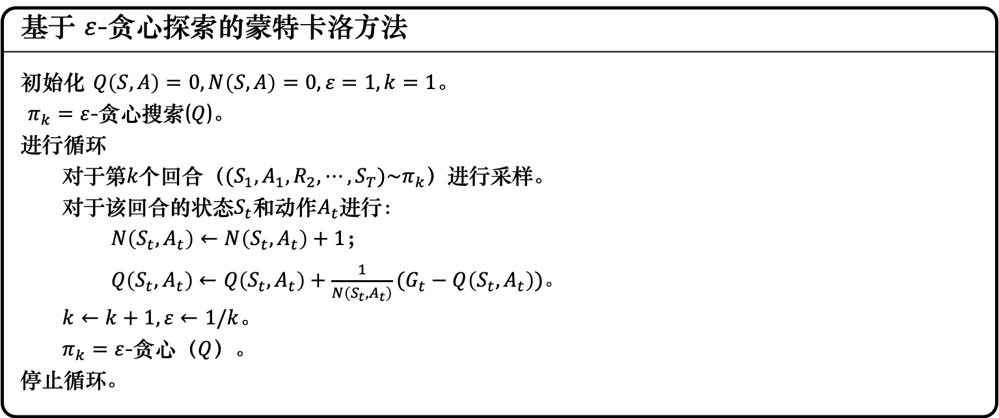
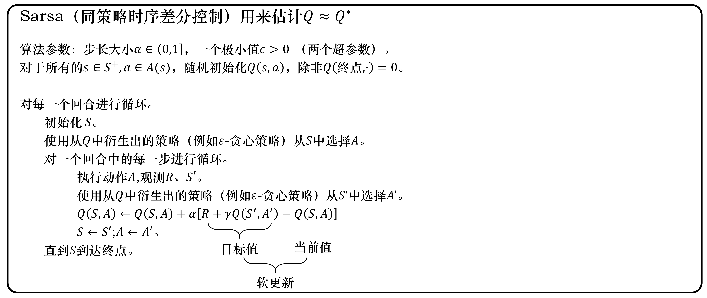
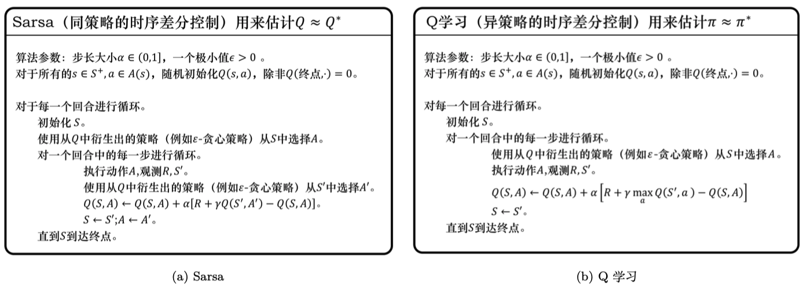
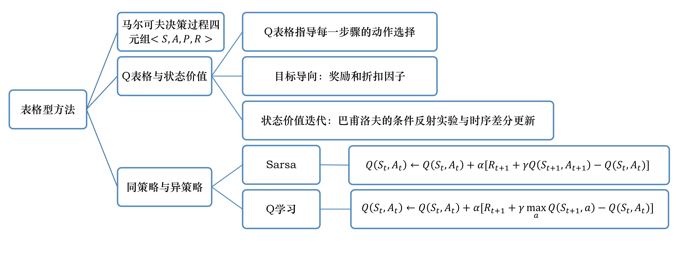

# 表格型方法

## 马尔可夫决策过程

马尔可夫决策过程四元组

$$
(S,A,P,R)
$$

状态转移概率

$$
p[s_{t+1},r_{t} \mid s_{t},a_{t}]
$$

在状态 $s_{t}$ 选择动作 $a_{t}$ 转移到状态 $s_{t+1}$ ，并且得到奖励 $r_{t}$ 的概率

### 有模型
已知状态转移概率和奖励函数

$$
\begin{aligned}
&p[s_{t+1},r_{t} \mid s_{t},a_{t}] \\
&R[s_{t},a_{t}]
\end{aligned}
$$

### 免模型
未知状态转移概率和奖励函数。强化学习像人类一样学习，通过尝试不同的路来学习。用价值函数 $V(s)$ 来表示状态是好的还是坏的，用 $Q(s_{t},a_{t})$ 状态-动作值函数来判断什么状态下采取什么动作能够取得最大奖励

## $Q$ 表格

  

我们最后就是要求解一张Q表格，行数是所有状态的数量，列数是动作的数量。智能体不断和环境交互，估算出每个状态下每个动作的平均总奖励，进而更新 $Q$ 表格。

回报

$$
G_{t}=r_{t+1}+\gamma r_{t+2}+\gamma ^2r_{t+3}+\ldots
$$

## 免模型预测
通过蒙特卡洛方法和时序差分方法估计某个给定策略的价值。

### 蒙特卡罗策略评估

给定策略 $\pi$ ，智能体与环境进行交互，可得到很多轨迹，每个轨迹的回报：

$$
G_{t}=r_{t+1}+\gamma r_{t+2}+\gamma ^2r_{t+3}+\ldots
$$

求出所有轨迹的回报的平均值，得到某一个策略对应状态的价值：

$$
V_{\pi}(s)=\mathbb{E}_{\tau \sim \pi}[G_{t} \mid s_{t}=s]
$$

为了得到评估 $V(s)$ ，采取如下步骤。
1. 在每个回合中，如果在时间步 $t$ 状态 $s$ 被访问了：
    * 状态 $s$ 访问数： $N(s) \leftarrow N(s)+1$
    * 状态 $s$ 总回报： $S(s) \leftarrow S(s)+G_{t}$
2. 状态 $s$ 价值： $V(s)=S_(s)/N(s)$
根据大数定律，当 $N(s) \rightarrow \infty$ 时, $V(s) \rightarrow V_{\pi}(s)$

把蒙特卡洛方法更新写成增量式蒙特卡洛方法。对于轨迹 $(s_{1},a_{1},r_{1},\ldots,s_{t})$ :

$$
N(s)\leftarrow N(s)+1 \\
V(s)\leftarrow V(s)+\frac{1}{N_{s}}(G_{t}-V(s)) \\
V(s)\leftarrow V(s)+\alpha(G_{t}-V(s)) 
$$

### 时序差分
对于某个给定的策略 $\pi$ ，在线的算出价值函数 $V_{\pi}$ .例如，每往前走一步，用得到的估计回报 $r_{t}+\gamma V(s_{t+1})$ 来更新上一时刻的值 $V(s_{t})$

$$
\begin{aligned}
V(s_t) &\leftarrow V(s_{t})+\alpha (r_{t+1}+\gamma V(s_{t+1})-V(s_{t})) \\
TD(0):V(s_t)&\leftarrow V(s_{t})+\alpha (G_{i,t}-V(s_{t})) \\
G^{n}_{t}&=r_{t+1}+\gamma r_{t+2}+\ldots+\gamma^{n-1}r_{t+n}+\gamma^{n}V(s_{t+n}) \\
TD(n):V(s_t)&\leftarrow V(s_{t})+\alpha (G^{n}_{t}-V(s_{t}))
\end{aligned}
$$

### 动态规划，蒙特卡洛，时序差分

$$
\begin{aligned}
DP&:V(s_{t})\leftarrow \mathbb{E}_{\pi}[r_{t+1}+\gamma V(s_{t+1})] \\
MC&:V(s_{t})\leftarrow V(s_{t})+\alpha(G_{t}-V(s_{t})) \\
TD(n)&:V(s)\leftarrow V(s_{t})+\alpha(G^{n}_{t}-V(s_{t}))
\end{aligned}
$$

  <table>
    <tr>
      <td></td>
      <td></td>
    </tr>
    <tr>
      <td align="center"><strong>动态规划</strong></td>
      <td align="center"><strong>蒙特卡洛</strong></td>
    </tr>
    <tr>
      <td></td>
      <td></td>
    </tr>
    <tr>
      <td align="center"><strong>时序差分</strong></td>
      <td align="center"><strong>热图</strong></td>
    </tr>
  </table>

## 免模型控制

### 带有蒙特卡洛和时序差分方法的广义策略迭代

#### 动态规划的策略迭代：
* 给定当前策略 $\pi_{i}$ 来估计价值函数 $V_{\pi_{i}}$ ,可以蒙特卡洛估计也可以动态规划，动态规划同样需要知道 $(P,R)$
* 计算动作价值函数 $Q_{\pi_{i}}(s,a)=R(s,a)+\gamma \sum_{s^{\prime} \in S}P(s^{\prime} \mid s,a)V_{\pi_{i}}(s^{\prime})$ ，并更新策略 $\pi_{i+1}(s)=\arg \max_{a}Q_{\pi_{i}}(s,a)$
#### 广义策略迭代
当不知道 $(P,R)$ 时，用蒙特卡洛的方法估计 $Q$ 函数,即填 $Q$ 表格，然后贪心进行策略更新：
* $Q=Q_{\pi}$
* $\pi(s)=\arg \max_{a}Q(s,a)$
##### 基于探索性开始的蒙特卡洛方法

##### 基于 $\epsilon$ -贪心探索的蒙特卡洛方法

$\epsilon$ -贪心指我们有 $1-\epsilon$ 概率按照 $Q$ 函数决定动作

也可以把时序差分方法放到控制循环中去估计 $Q$ 表格。

### Sarsa:同策略时序差分控制
用时序差分的方法更新 $Q$ :

$$
Q(s_{t},a_{t})\leftarrow Q(s_{t},a_{t})+\alpha[\underbrace{r_{t+1}+\gamma Q(s_{t+1},a_{t+1})}_{\text 时序差分目标}-Q(s_{t},a_{t})]
$$

每次更新 $Q$ 时要知道当前的状态，动作，奖励，下一步的状态和动作，即 $(s_{t},a_{t},r_{t+1},s_{t+1},a_{t+1})$ ,因此得名**Sarsa**算法

$$
\begin{array}{lrl}
	&Q(S, A) &\leftarrow Q(S, A)+\alpha\left(R+\gamma Q\left(S^{\prime}, A^{\prime}\right)-Q(S, A)\right) \\
	{n=1}\text {（Sarsa）} &Q_{t}^{1}&=r_{t+1}+\gamma Q\left(s_{t+1}, a_{t+1}\right) \\
	n=2 &Q_{t}^{2}&=r_{t+1}+\gamma r_{t+2}+\gamma^{2} Q\left(s_{t+2}, a_{t+2}\right) \\
	&&\vdots \\
	n=\infty\text{（MC）} \quad &Q_{t}^{\infty}&=r_{t+1}+\gamma r_{t+2}+\ldots+\gamma^{T-t-1} r_{T}
	\end{array} 
$$

智能体每与环境交互一次后就可以学习一次，向环境输出动作，从环境中获得状态和奖励。智能体主要实现俩个方法：
* 根据 $Q$ 表格选择动作，输出动作
* 获取 $(s_{t},a_{t},r_{t+1},s_{t+1},a_{t+1})$ ，更新 $Q$ 表格

## Q学习：异策略时序差分控制

sarsa是一种同策略算法，优化的是它实际执行的策略，它直接用下一步会执行的动作去优化 $Q$ 表格。

Q学习是一种异策略算法，学习的过程中有俩种不同的策略：目标策略和行为策略：
* 目标策略 $\pi$ ，直接在 $Q$ 表格上使用贪心策略：

$$
\pi(s_{t+1})=\arg \max_{a^{\prime}}Q(s_{t+1},a^{\prime})
$$

* 行为策略 $\mu$ 可以是一个随机的策略，但我们采取 $\epsilon$ -贪心策略，让行为策略不至于是完全随机，而是基于 $Q$ 表格逐渐改进的.

$Q$ 学习更新:

$$
\begin{aligned}
Q(s_{t},a_{t})\leftarrow Q(s_{t},a_{t})+\alpha \left[\underbrace{r_{t+1}+\gamma \max_{a}Q(s_{t+1},a)}_{\text 时序差分目标}-Q(s_{t},a_{t})\right]
\end{aligned}
$$

## 总结
比较一下 Q学习 和 Sarsa 的更新公式，就可以发现 Sarsa 并没有选取最大值的最大化操作。因此，Q学习是一个非常激进的方法，它希望每一步都获得最大的利益；Sarsa 则相对较为保守，它会选择一条相对安全的迭代路线。

