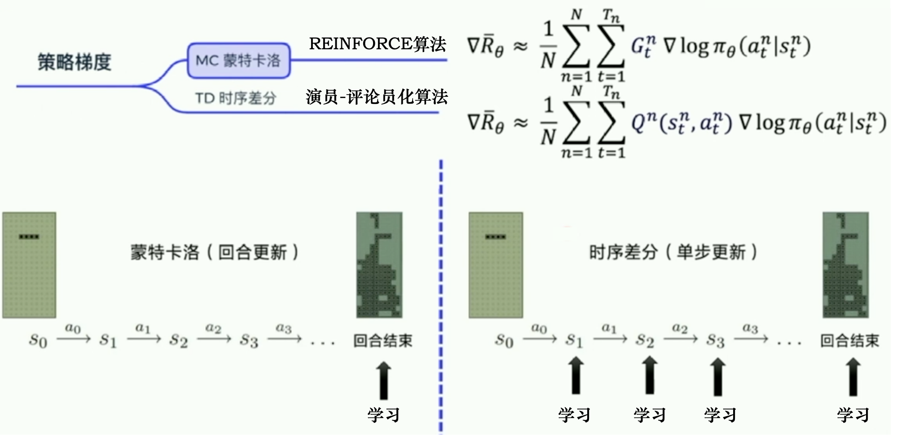
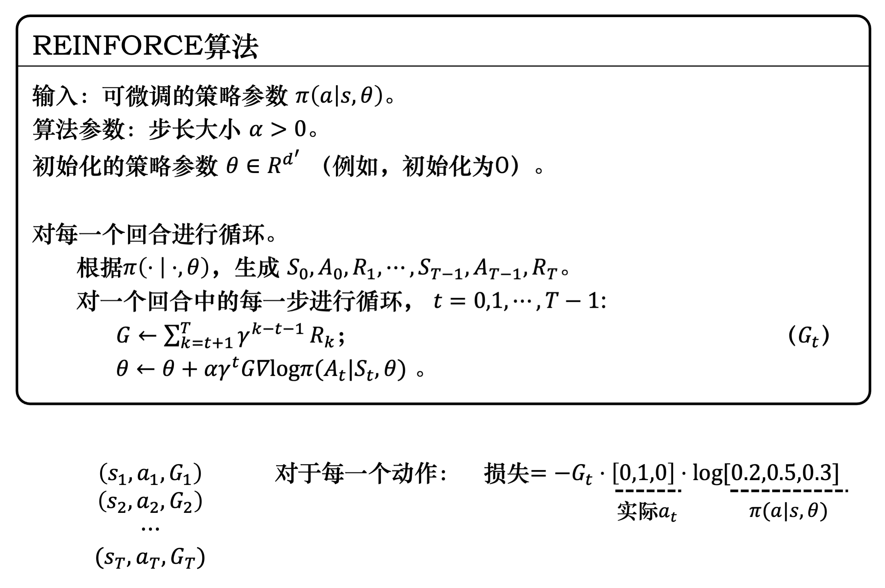

# 策略梯度

## 策略梯度算法
强化学习3个组成部分：**演员**，**环境**和**奖励函数**。
* **演员**里面的策略决定了演员的动作。策略记作$\pi$，假设用深度学习网络来做强化学习，策略就是一个网络，网络参数为$\theta$,网络的输入为观测的环境，输出为动作概率
* **环境**也可看作一个函数，该函数最开始吐出状态$s_{1}$,随后演员根据$s_{1}$做出动作$a_{1}$，环境再把前一个状态和动作作为输入，吐出下一个状态，直到停止
* **奖励函数**根据在某一个状态采取的某一个总做决定这个动作可以得到的分数。输入$s_{1}$,$a_{1}$,输出$r_{1}$，输入$s_{2}$,$a_{2}$输出$r_{2}$。把一个轨迹的奖励r全加起来得到$R(\tau)$。根据分布$p_{\theta}(\tau)$可以得到很多轨迹，用期望奖励表示该分布好坏。

$$
\begin{aligned}
\tau
&=\left\{s_{1},a_{1},s_{2},a_{2},\cdots,s_{t},a_{t}\right\} \\
p_{\theta}(\tau)
&=p(s_{1}) p_{\theta}(a_{1} \mid s_{1}) p(s_{2} \mid s_{1}, a_{1}) p_{\theta}(a_{2} \mid s_{2}) p(s_{3} \mid s_{2}, a_{2}) \cdots \\
&=p(s_{1}) \prod_{t=1}^{T} p_{\theta}(a_{t} \mid s_{t}) p(s_{t+1} \mid s_{t}, a_{t}) \\
R(\tau)
&=\sum^{T}_{t=1}r_{t} \\
\bar R_{\theta}
&=\sum_{\tau}R(\tau)p_{\theta}(\tau)=\mathbb{E}_{\tau \sim p_{\theta}(\tau)}[R(\tau)] \\
\end{aligned}
$$

要让奖励奖励越大越好，可以使用**梯度上升**来最大化期望奖励。对、期望奖励$\bar R_{\theta}$对参数$\theta$做梯度运算

$$
\begin{aligned}
\nabla \bar R_{\theta}
&=\sum_{\tau}R(\tau)\nabla p_{\theta}(\tau) \\
&=\sum_{\tau}R(\tau)p_{\theta}(\tau)\frac{\nabla p_{\theta}(\tau)}{p_{\theta}(\tau)} \\
&=\sum_{\tau}R(\tau)p_{\theta}(\tau)\nabla \log p_{\theta}(\tau) \\
&=\mathbb{E}_{\tau \sim p_{\theta}(\tau)}\left[R(\tau)\nabla \log p_{\theta}(\tau)\right]
\end{aligned}
$$

通过采样的方式，采样$N$个$\tau$并计算每一个值，把每一个值加起来得到梯度。

$$
\begin{aligned}
\nabla \log p_{\theta}(\tau) 
&=\nabla \log \left(p(s_{1}) \prod_{t=1}^{T} p_{\theta}(a_{t} \mid s_{t}) p(s_{t+1} \mid s_{t}, a_{t})\right) \\
&=\sum_{t=1}^{T} \nabla \log p_{\theta}(a_{t} \mid s_{t}) \\
\mathbb{E}_{\tau \sim p_{\theta}(\tau)}\left[R(\tau) \nabla \log p_{\theta(\tau)}\right] 
&\approx \frac{1}{N}\sum_{n=1}^{N}R(\tau^{n})\nabla \log p_{\theta}(\tau^{n}) \\
&=\frac{1}{N} \sum_{n=1}^{N} \sum_{t=1}^{T_{n}} R\left(\tau^{n}\right) \nabla \log p_{\theta}\left(a_{t}^{n} \mid s_{t}^{n}\right) \\
\theta &\leftarrow \theta + \eta \nabla \bar R_{\theta}
\end{aligned}
$$

首先要收集很多$s$与$a$的$pair$，还要知道这些$s$与$a$在与环境交互的时候会得到多少奖励。用参数为$\theta$的智能体与环境交互得到大量轨迹数据，再把梯度算出来更新参数$\theta$,更新完参数后，重新采样数据开启下一轮(每次都要重新采样数据，这一步花费大量时间)。**其实就是最大化似然函数，不过加上了奖励的权重，可以用pytorch等深度学习框架实现实现**
## 策略梯度实现技巧
### 添加基线
奖励$R(\tau)$有时候总是正的，那么对于什么状态下采取什么动作的概率都是提高的，不过是提高的少与多。我们希望奖励不总是正的，引入一个基线$b$

$$
\begin{aligned}
\nabla \bar R_{\theta} 
&\approx \frac{1}{N} \sum_{n=1}^{N} \sum_{t=1}^{T_{n}} (R(\tau^{n})-b)\nabla \log p_{\theta}(a_{t}^{n} \mid s_{t}^{n}) \\
b
&=\mathbb{E}[R(\tau)] \\
\end{aligned}
$$

### 分配合适的分数
给每个动作分配合适的分数。假设整场游戏的结果是好的，不代表这场游戏里面的每个动作都是好的。计算某个状态-动作对奖励的时候，不把正常游戏得到的奖励全部加起来，只计算这个动作执行以后得到的奖励，因为执行这个动作之前得到的奖励都不能算是这个动作的贡献。还可以引入奖励折扣，公式可以改为：

$$
\begin{aligned}
\nabla \bar R_{\theta} 
&\approx \frac{1}{N} \sum_{n=1}^{N} \sum_{t=1}^{T_{n}} (\sum_{t^{\prime}=t}^{T_{n}}\gamma ^{t^{\prime}-t}r_{t{\prime}}^{n}-b)\nabla \log p_{\theta}(a_{t}^{n} \mid s_{t}^{n}) \\
\end{aligned}
$$

>我们把 $R-b$ 这一项称为**优势函数（advantage function）**， 用 $A^{\theta}(s_t,a_t)$ 来代表优势函数。优势函数 **$A^{\theta}(s_{t}, a_{t})$** 的上标是 $\theta$，$\theta$ 代表用模型 $\theta$ 与环境交互。从时刻 $t$ 开始到游戏结束为止，所有 $r$ 的加和减去 $b$，这就是优势函数。优势函数在意的不是绝对的好，而是相对的好，即**相对优势（relative advantage）**。因为在优势函数中，我们会减去一个基线 $b$，所以这个动作是相对的好，不是绝对的好。 **$A^{\theta}(s_{t}, a_{t})$** 通常可以由一个网络估计出来，这个网络称为**评论员（critic）**。 

## REINFORCE：蒙特卡洛策略梯度
### 蒙特卡洛和时序差分策略梯度

### REINFORCE
REINFORCE用的是回合更新的方式，先获取每个步骤的奖励，然后计算每个步骤的未来总奖励$G_{t}$，将每个$G_{t}$代入：

$$
\begin{aligned}
\nabla \bar{R}_{\theta} &\approx \frac{1}{N} \sum_{n=1}^{N} \sum_{t=1}^{T_{n}} G_{t}^{n} \nabla \log \pi_{\theta}\left(a_{t}^{n} \mid s_{t}^{n}\right) \\
G_{t}
&=\sum_{k=t+1}^{T} \gamma^{k-t-1} r_{k} \\
&=r_{t+1}+\gamma G_{t+1}
\end{aligned}
$$

