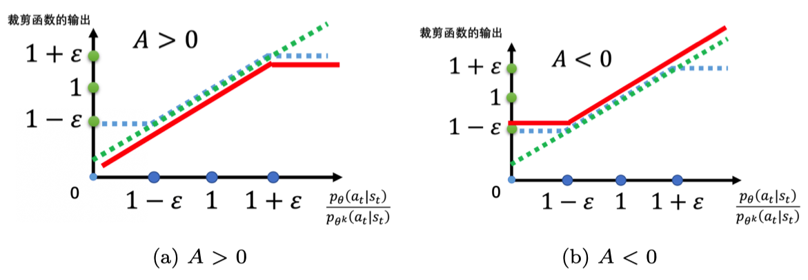

# PPO算法
回顾一下策略梯度,就是对策略$\pi_{\theta}$采样一系列轨迹$\tau$并求奖励的期望，再求梯度更新参数$\theta$,每次更新后参数$\theta$都会发生变化，所以更新完后需要重新采样。这其实是一种**同策略方法**，就是要学习的智能体和环境交互的智能体是相同的，相反如果是不同的就是**异策略方法**
$$
\nabla \bar R_{\theta} =\mathbb{E}_{\tau \sim p_{\theta}(\tau)}[R(\tau)\nabla \log p_{\theta}(\tau)]
$$

将同策略变为异策略，用另外一个策略$\pi_{\theta^{\prime}}$和另外一个演员$\theta^{\prime}$和环境交互，采样数据$\tau$，用这些数据去训练$\theta$，这样$\theta$可以多次使用这些数据

## 重要性采样

从分布$p$采样$x$，代入$f$，得到$f(x)$,计算$f(x)$的期望值。如果不从$p$分布采样数据，从另外一个分布$q$采样数据，又如何计算$f(x)$的期望值。推导如下：
$$
\begin{aligned}
\mathbb{E}_{x \sim p}[f(x)] =\int f(x)p(x) dx=\int f(x)\frac{p(x)}{q(x)}q(x)dx=\mathbb{E}_{x \sim q}[f(x)\frac{p(x)}{q(x)}]
\end{aligned}
$$
理论上可以把$p$换成任何的$q$，但是从方差上看这个替换是有差距的,如果采样次数不够多,方差差距会很大:
$$
\begin{aligned}
Var_{x \sim p}[f(x)]
&=\mathbb{E}_{x \sim p}[f(x)^2]-(\mathbb{E}_{x \sim p}[f(x)])^2 \\
Var_{x \sim q}[f(x)\frac{p(x)}{q(x)}]
&=\mathbb{E}_{x \sim q}\left[(f(x)\frac{p(x)}{q(x)})^2\right]-\left(\mathbb{E}_{x \sim q}\left[f(x)\frac{p(x)}{q(x)}\right]\right)^2 \\
&= \mathbb{E}_{x \sim p}\left[f(x)^2\frac{p(x)}{q(x)}\right]-(\mathbb{E}_{x \sim p}[f(x)])^2
\end{aligned}
$$
### 异策略梯度
应用到策略梯度当中,$p_{\theta}(s_{t})$可以忽略:
$$
\begin{aligned}
\nabla \bar R_{\theta}
&=\mathbb{E}_{\tau \sim p_{\theta}(\tau)}\left[\frac{p_{\theta}(\tau)}{p_{\theta^{\prime}}(\tau)}R(\tau)\nabla \log p_{\theta}(\tau)\right] \\
&=\mathbb{E}_{(s_{t},a_{t})\sim \pi_{\theta^{\prime}}}\left[\frac{p_{\theta}(s_{t},a_{t})}{p_{\theta^{\prime}}(s_{t},a_{t})}A^{\theta^{\prime}}(s_{t},a_{t})\nabla \log p_{\theta}(a_{t}^{n} \mid s_{t}^{n})\right] \\
&=\mathbb{E}_{(s_{t},a_{t})\sim \pi_{\theta^{\prime}}}\left[\frac{p_{\theta}(a_{t} \mid s_{t})p_{\theta}(s_{t})}{p_{\theta^{\prime}}(a_{t}\mid s_{t})p_{\theta^{\prime}}(s_{t})}A^{\theta^{\prime}}(s_{t},a_{t})\nabla \log p_{\theta}(a_{t}^{n} \mid s_{t}^{n})\right] \\
&=\mathbb{E}_{(s_{t},a_{t})\sim \pi_{\theta^{\prime}}}\left[\frac{p_{\theta}(a_{t} \mid s_{t})}{p_{\theta^{\prime}}(a_{t}\mid s_{t})}A^{\theta^{\prime}}(s_{t},a_{t})\nabla \log p_{\theta}(a_{t}^{n} \mid s_{t}^{n})\right]
\end{aligned}
$$
目标函数就可以写为:
$$
J^{\theta^{\prime}}(\theta)=\mathbb{E}_{(s_{t},a_{t}) \sim \pi_{\theta^{\prime}}}\left[\frac{p_{\theta}(a_{t}\mid s_{t})}{p_{\theta^{\prime}}(a_{t}\mid s_{t})}A^{\theta^{\prime}}(s_{t},a_{t})\right]
$$
## 近端策略优化
重要采样中，如果$p_{\theta}(a_{t} \mid s_{t})$和$p_{\theta^{\prime}}(a_{t} \mid s_{t})$相差太多，结果就不会好。PPO就是要解决这个问题
$$
\begin{aligned}
J_{PPO}^{{\theta^\prime}}(\theta)
&=J^{\theta ^ \prime}(\theta) - \beta KL(\theta,\theta^\prime) \\
J^{\theta^{\prime}}(\theta)
&=\mathbb{E}_{(s_{t},a_{t}) \sim \pi_{\theta^{\prime}}}\left[\frac{p_{\theta}(a_{t}\mid s_{t})}{p_{\theta^{\prime}}(a_{t}\mid s_{t})}A^{\theta^{\prime}}(s_{t},a_{t})\right] \\
KL(\theta,\theta^\prime)
&= \\
J_{TRPO}^{\theta^{\prime}}(\theta)
&=\mathbb{E}_{(s_{t},a_{t}) \sim \pi_{\theta^{\prime}}}\left[\frac{p_{\theta}(a_{t}\mid s_{t})}{p_{\theta^{\prime}}(a_{t}\mid s_{t})}A^{\theta^{\prime}}(s_{t},a_{t})\right],KL(\theta,\theta^\prime)< \delta
\end{aligned}
$$
### 近端策略优化惩罚(PPO-penalty)
初始化一个策略的参数$\theta^0$每一个迭代里，用前一个参数$\theta^{k}$与环境交互，根据$\theta^{k}$的交互，估测$A^{\theta^{k}}(s_{t},a_{t})$，再进行参数更新，这里可以更新很多次。
$$
\begin{aligned}
J^{k}_{PPO}(\theta)
&=J^{\theta^\prime}(\theta)-\beta KL(\theta,\theta^{k})
\end{aligned}
$$
自适应KL惩罚:
*  如果$KL(\theta,\theta^k)>KL_{max}$,增大$\beta$
*  如果$KL(\theta,\theta^k)< KL_{min}$,减小$\beta$
### 近端策略优化裁剪(PPO-clip)
目标函数里没有KL散度。要最大化的目标为：
$$
    \begin{aligned}
        J_{\mathrm{PPO2}}^{\theta^{k}}(\theta) \approx \sum_{\left(s_{t}, a_{t}\right)} \min &\left(\frac{p_{\theta}\left(a_{t} | s_{t}\right)}{p_{\theta^{k}}\left(a_{t} | s_{t}\right)} A^{\theta^{k}}\left(s_{t}, a_{t}\right),\right.\\
        &\left.\operatorname{clip}\left(\frac{p_{\theta}\left(a_{t} | s_{t}\right)}{p_{\theta^{k}}\left(a_{t} | s_{t}\right)}, 1-\varepsilon, 1+\varepsilon\right) A^{\theta^{k}}\left(s_{t}, a_{t}\right)\right)
        \end{aligned} 
$$
如图所示，$\frac{p_{\theta}\left(a_{t} | s_{t}\right)}{p_{\theta^{k}}\left(a_{t} | s_{t}\right)}$ 是绿色的线；$\operatorname{clip}\left(\frac{p_{\theta}\left(a_{t} | s_{t}\right)}{p_{\theta^{k}}\left(a_{t} | s_{t}\right)}, 1-\varepsilon, 1+\varepsilon\right)$ 是蓝色的线；在绿色的线与蓝色的线中间，我们要取一个最小的结果。A的正负会影响这个取值

* 如果 $A > 0$，也就是某一个状态-动作对是好的，我们希望增大这个状态-动作对的概率。也就是，我们想让  $p_{\theta}(a_{t} | s_{t})$ 越大越好，但它与 $p_{\theta^k}(a_{t} | s_{t})$ 的比值不可以超过 $1+\varepsilon$。如果超过 $1+\varepsilon$  ，就没有好处了。红色的线就是目标函数，我们希望目标函数值越大越好，我们希望 $p_{\theta}(a_{t} | s_{t})$ 越大越好。但是 $\frac{p_{\theta}\left(a_{t} | s_{t}\right)}{p_{\theta^{k}}\left(a_{t} | s_{t}\right)}$ 只要大过 $1+\varepsilon$，就没有好处了。**所以在训练的时候，当 $p_{\theta}(a_{t} | s_{t})$ 被训练到 $\frac{p_{\theta}\left(a_{t} | s_{t}\right)}{p_{\theta^{k}}\left(a_{t} | s_{t}\right)}>1+\varepsilon$ 时，它就会停止**。假设 $p_{\theta}(a_{t} | s_{t})$  比 $p_{\theta^k}(a_{t} | s_{t})$ 还要小，并且这个优势是正的。因为这个动作是好的，我们希望这个动作被采取的概率越大越好，希望 $p_{\theta}(a_{t} | s_{t})$ 越大越好。所以假设 $p_{\theta}(a_{t} | s_{t})$ 还比 $p_{\theta^k}(a_{t} | s_{t})$  小，那就尽量把它变大，但只要大到 $1+\varepsilon$ 就好。

* 如果 $A < 0$，也就是某一个状态-动作对是不好的，那么我们希望把 $p_{\theta}(a_{t} | s_{t})$ 减小。如果 $p_{\theta}(a_{t} | s_{t})$ 比 $p_{\theta^k}(a_{t} | s_{t})$  还大，那我们就尽量把它减小，**减到 $\frac{p_{\theta}\left(a_{t} | s_{t}\right)}{p_{\theta^{k}}\left(a_{t} | s_{t}\right)}$ 是 $1-\varepsilon$ 的时候停止，此时不用再减得更小**。
