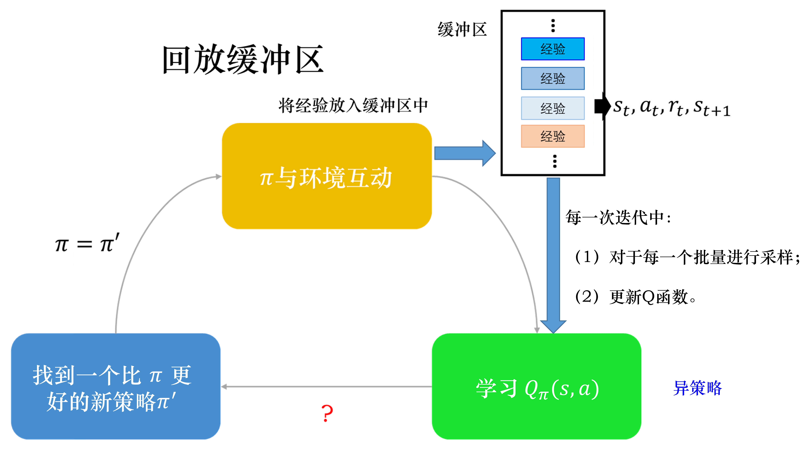

# DQN 深度Q网络

之前是用表格的方法存储$V(s)$和$Q(s，a)$，然而对于连续的状态空间，表格方法是不可行的。所以用一个深度网络近似这个价值函数，称为价值函数近似：

$$
    \begin{aligned}
    V_{\phi}(\boldsymbol{s})
    &\approx V_{\pi}(\boldsymbol{s}) \\
    Q_{\phi}(\boldsymbol{s},\boldsymbol{a})
    &\approx Q_{\pi}(\boldsymbol{s},\boldsymbol{a})
    \end{aligned}
$$

其中$\boldsymbol{s}$,$\boldsymbol{a}$分别是状态$s$,动作$a$的向量表示。$\phi$是这个网络的参数。

先给出DQN的一般算法之后会详细解释：

事实上这个算法适用离散动作，因为$\max_{a}Q$对于连续动作是很难找到最大值的。

## 状态价值函数

状态价值函数$V_{\pi}$也称为**评论员(critic)**。含义为：假设演员的策略是$\pi$，用$\pi$和环境交互，演员看到某一个状态，从这时到游戏结束，期望的累计奖励。

$$
    \begin{aligned}
    V_{\pi}(s)
    &=\mathbb{E}_{\pi}[G_{t}\mid s_{t}=s] \\
    G_{t}
    &=r_{t+1}+\gamma r_{t+2}+\gamma^2 r_{t+3}+\cdots
    \end{aligned}
$$

### 蒙特卡洛方法

让演员以策略$\pi$和环境交互，直到游戏结束，并统计累计奖励。例如在状态$s_{a}$，接下来的累计奖励是$G_{a}$,$V_{\pi}(s_{a})$便回归拟合$G_{a}$;在状态$s_{b}$，接下来的累计奖励是$G_{b}$,$V_{\pi}(s_{b})$便回归拟合$G_{b}$

### 时序差分方法

蒙特卡洛方法需要走完整个游戏才能更新参数，并且蒙特卡洛累计方差大。

时序差分方法不需要玩到游戏结束：

$$
    \begin{aligned}
    V_{\pi}(s_{t})
    &=V_{\pi}(s_{t+1})+r_{t} \\
    V_{\pi}(s_{t})-V_{\pi}(s_{t+1})
    &\longleftrightarrow r_{t}
    \end{aligned}
$$
用$V_{\pi}(s_{t})-V_{\pi}(s_{t+1})$去拟合$r_{t}$

## 动作价值函数
动作价值函数$Q_{\pi}(s,a)$的输入是一个状态动作对，指在某一个状态采取某一个动作，由演员$\pi$得到的累计奖励的期望。

有俩种写法：
* 输入状态与动作，输出标量
* 输入状态，输出多个值，这些值分别表示采取该动作的标量值

$Q_{\pi}(s,a)$同样可以由蒙特卡洛和时序差分的方法去更新学习，学习好策略$\pi$的$Q$函数之后，就可以找到下一个更好的新的策略$\pi^{\prime}$，如此下去一直迭代。

$$
    \begin{aligned}
    \pi^{\prime}(s)
    &=\arg \max_{a}Q_{\pi}(s,a) \\
    V_{\pi^{\prime}}(s)
    &\geqslant V_{\pi}(s)
    \end{aligned}
$$

证明过程不在此描述

## DQN技巧

### 目标网络

对于时序差分方法：
$$
    \begin{aligned}
    Q_{\pi}(s_{t},a_{t})=r_{t}+Q_{\pi}(s_{t+1},\pi(s_{t+1}))
    \end{aligned}
$$
用$Q_{\pi}(s_{t},a_{t})-Q_{\pi}(s_{t+1},\pi(s_{t+1}))$去拟合$r_{t}$是不稳定的。我们可以固定主右边的网络，将等式右边的值当作$Q_{\pi}(s_{t},a_{t})$拟合的目标，可以把$Q_{\pi}(s_{t},a_{t})$更新多次去拟合这个目标，之后再用更新后的$Q_{\pi}(s_{t},a_{t})$替换到灯饰右边

### 探索

给定某一个状态$s$。穷举所有动作，采取让$Q$值最大的动作:

$$
a=\arg \max_{a}Q(s,a)
$$

这样对环境的探索有可能是不够的，有俩个方法解决这个问题：$\epsilon$-贪心和波尔茨曼探索

**$\epsilon$-贪心**指有$1-\epsilon$的概率按照$Q$函数执行动作
$$
    a=
    \begin{cases}
        \underset{a}{\arg \max} Q(s, a) & \text {, 有 } 1-\varepsilon \text { 的概率 } \\
        \text { 随机} & \text {, 否则 }  
    \end{cases}
$$

在**波尔茨曼探索**中，假设对于任意的$s$，$a$,$Q(s,a)\geqslant 0$，因此a被选中的概率与$\mathrm{e}^{Q(s,a)/T}$成正比:

$$
    \pi(a \mid s)=\frac{\mathrm{e}^{Q(s,a)/T}}{\sum_{a^\prime \in A}\mathrm{e}^{Q(s,a^\prime)/T}}
$$

T>0称为温度系数，T很大，所有动作几乎以等概率选择，如果T很小，Q值大的动作容易未选中，T趋于0，只选择最优动作。

### 经验回放

经验回访会构建一个回放缓冲区，把与环境交互的数据存储在缓冲区，每一笔数据包含$(s_{t},a_{t},r_{t},s_{t+1})$，这些数据可能来自于不同的策略。训练时从缓冲区随机跳出一个批量出来，用这些数据去更新$Q$函数，这是一种异策略的方法

