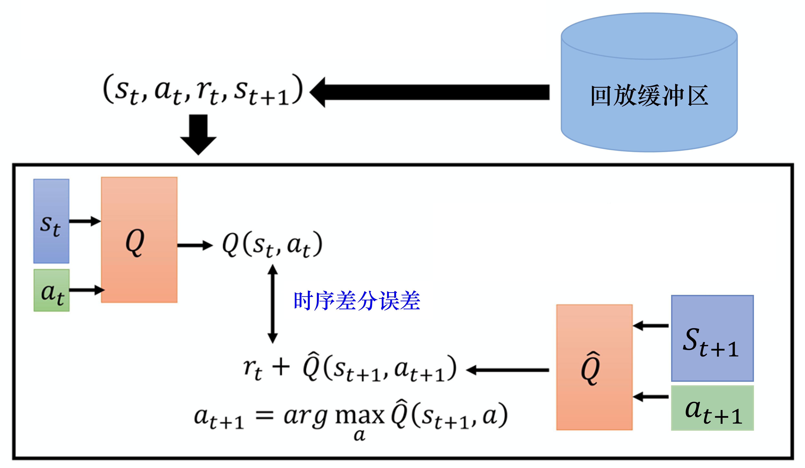
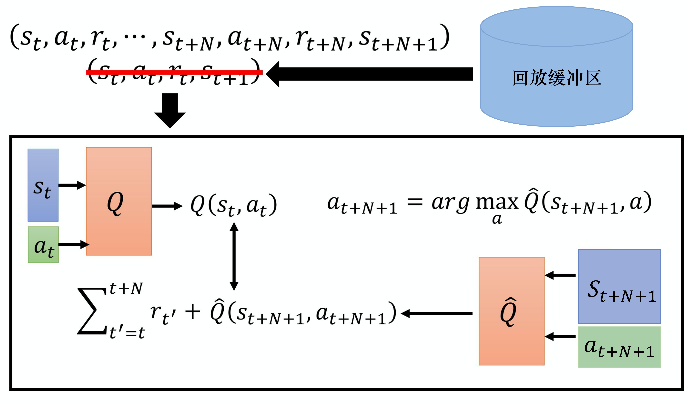
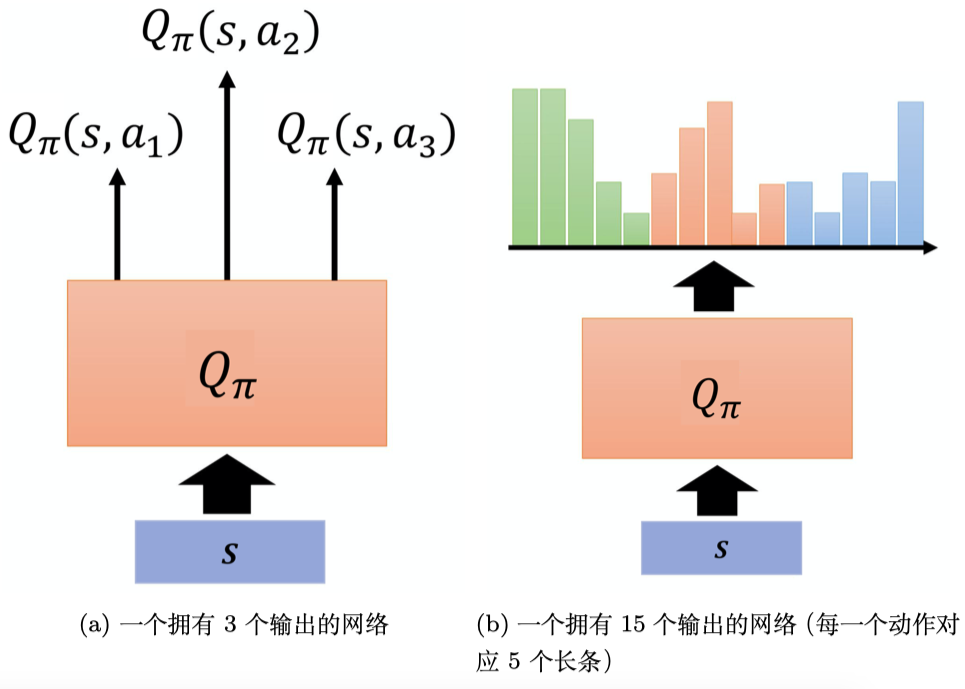

# DQN进阶技巧

## 双深度Q网络-DDQN

DQN中 $Q$ 值往往被高估，因为我们的目标是 $Q(s_{t},a_{t}) \longleftrightarrow r_{t}+\max_{a}Q(s_{t+1},a)$ , 如果最开始网络对某个动作的误差很大，高估了 $Q$ ,那么之后总是会选择这个被高估的动作。

DDQN 更改了选动作的网络，原来是用目标网络 $Q^\prime$ 选动作，现在用会更新的 $Q$ 选动作：

$$
Q(s_t,a_t) \longleftrightarrow r_t + Q^{\prime}\left(s_{t+1},\arg \max_{a}Q(s_{t+1},a)\right)
$$

## 竞争深度Q网络-dueling DQN
dueling DQN 改变了网络的架构，原来是输出 $Q(s,a)$ ，现在不直接输出 $Q$ 值，而是分成俩条路径，分别输出：标量 $V(s)$ ,向量 $A(s,a)$ .把这俩值加起来得到 $Q(s,a)$ .

$$
Q(s,a)=V(s)+A(s,a)
$$

为什么要增加一个 $V(s)$ ? 我们把标量 $V(s)$ 加在 $A(s,a)$ 上，对于没采集到的动作，也会因为 $V(s)$ 被同步更新，提高了数据利用率。但是如果 $V(s)$ 等于0，那么 $A(s,a)$ 又相当于 $Q$ 了。为解决这个问题，给 $A(s,a)$ 进行零均值化。

## 优先级经验回放-PER

原来是在回放缓冲区里均匀的采样数据，现在对其中时序误差 $Q(s_{t},a_{t}) \longleftrightarrow r_{t}+\hat{Q}(s_{t+1},a_{t+1})$ 较大的样本给予较大的采样概率。

## MC与TD中取得平衡

时序差分有一步和多步的方法，蒙特卡洛则是走完整个步数。采用多步的方法平衡俩者之间的差距。

$$
(s_t,a_t,r_t,s_{t+1},\ldots,s_{t+N},a_{t+N},r_{t+N},s_{t+N+1}) \\
Q(s_t,a_t) \longleftrightarrow \sum_{t^\prime=t}^{t+N} r_{t^\prime}+\hat{Q}(s_{t+N+1},a_{t+N+1})
$$

## 噪声网络

这是一种探索方法，在参数的空间上加上噪声。在一个回合开始前，智能体与环境交互前，给 $Q$ 函数加上噪声变成 $\tilde{Q}$ ，接下来整个回合用这个 $\tilde{Q}$ 执行动作。

$$
a=\arg \max _{a} \tilde{Q}(s,a)
$$

相比于之前提到的, $\epsilon$ -贪心和波尔茨曼方法在某一步中有随机性的探索，噪声网络是一种系统性的探索方法，因为整个回合都采用了这个 $\tilde{Q}$ 执行动作 

## 分布式Q函数

前面的网络都是直接或间接输出一个 $Q$ 值，这个值实际上指的是期望。分布式Q函数直接对这个Q值的分布建模。

## 彩虹

上面提到的所有的技巧，都是独立的，可以将他们全部融合在一起，通过消融实验剔除或者留下某个技巧。

