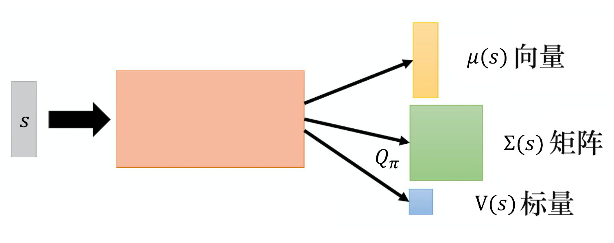
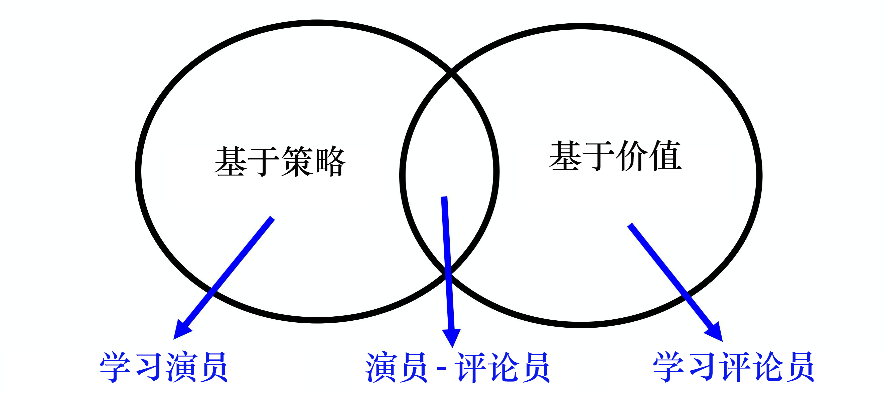

# 针对连续动作的DQN

执行动作时有一个 $a=\arg \max_{a}Q(s,a)$ 的最大化操作，如果动作是离散的那么可以穷举动作，如果动作是连续的呢?

## 对动作采样
即采样出 $N$ 个可能的动作 $a:\{a_1,a_2,\cdots,a_N\}$ .这个方法并不精确。

## 梯度上升
用梯度上升的方法解决最优化问题 $a=\arg \max_{a}Q(s,a)$ ，有可能陷入局部全局的问题。这个方法运算量大。

## 设计网络架构
巧妙的设计 $Q$ 网络架构来解决 $\arg \max$ 操作问题。

$$
Q(s,a)=-(a-\mu(s))^{T} \Sigma(s)(a-\mu(s))+V(s)
$$

网络输入 $s$ ,输出向量 $\mu(s)$,矩阵 $\Sigma(s)$ ,标量 $V(s)$ 。  矩阵 $\Sigma(s)$ 是正定矩阵。
> 如果 $n$ 阶对称矩阵 $A$ 对于任意非零的 $n$ 维向量 $x$ 都有 $x^TAx>0$ ,则称矩阵 $A$ 为正定矩阵.

要使得 $Q$ 最大令 $\mu(s)=a$ 即可。

## 演员-评论员的方法

将基于策略的方法-PPO和基于价值的方法-DQN结合在一起，得到演员-评论员的方法.

