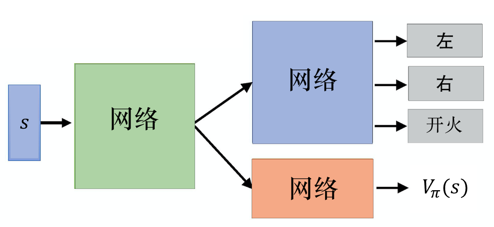
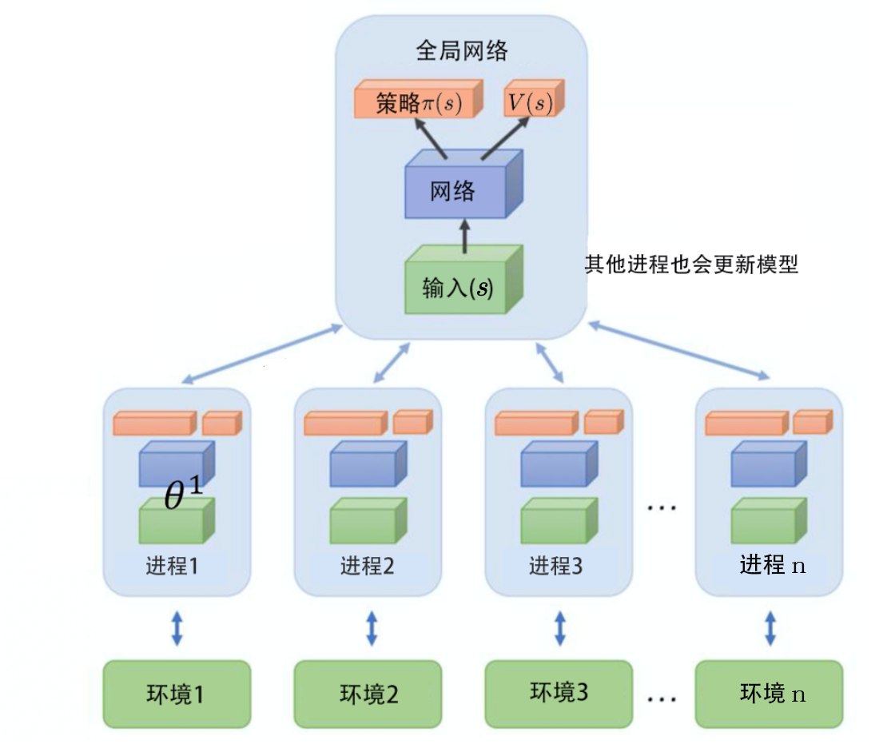
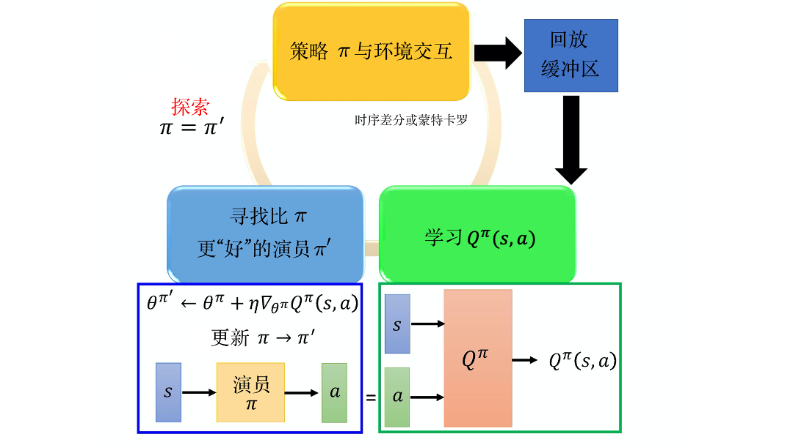

# 演员评论员算法 -A2C

演员评论员算法是一种结合策略梯度和时序差分学习的强化学习方法。演员指 $\pi_{\theta}(a \mid s)$ ，即学习一个策略以得到尽可能高的回报；评论员指价值函数 $V_{\pi}(s) \quad Q_{\pi}(a,s)$ ，即对当前策略的值函数估计。

## [策略梯度回顾](3.策略梯度.md)

需要用策略 $\pi$ 完成整个回合，策略参数梯度：

$$
    \nabla \bar R_{\theta} \approx \frac{1}{N} \sum_{n=1}^{N} \sum_{t=1}^{T_{n}}\left(\sum_{t^\prime=t}^{T_n} \gamma^{t^{\prime}-t} r_{t^{\prime}}^{n} -b \right) \nabla \log p_{\theta}(a_{t}^{n} \mid s_{t}^{n})
$$

* $N$ : 回合数
* $\sum_{t^{\prime}=t}^{T_{n}} \gamma^{t^{\prime}-t}r_{t^\prime}^{n}$ 其实就是状态 $s_t$ 采取动作 $a_t$ 的累计奖励 $G_{t}^{n}$ ，但是实际上 $G_{t}^{n}$ 是随机变量，所以如果采样数不够多，方差会很大
* $b$ :基线值，让系数有正有负

## [DQN 回顾](5.DQN.1.md)

DQN 有俩种评论员 $V_{\pi}(s)$ 和 $Q_{\pi}(s,a)$ ,并且 $V_{\pi}(s) = E_{a \sim \pi(s)}[Q_{\pi}(s,a)]$

## 优势演员-评论员算法

对策略梯度的公式做如下替换:

$$
\begin{aligned}
    \sum_{t^\prime=t}^{T_{n}} \gamma^{t^{\prime}-t}r_{t^\prime}^{n}&=\mathbb{E}[G_{t}^{n}]=
    Q_{\pi_{\theta}}(s_{t}^{n},a_{t}^{n}) \\
    b
    &=V_{\pi_{\theta}}(s_{t}^{n}) \\
    A^{\theta}(s_{t}^{n},a_{t}^{n})
    &= Q_{\pi_{\theta}}(s_{t}^{n},a_{t}^{n})-V_{\pi_{\theta}}(s_{t}^{n}) \\
    \nabla \bar R_{\theta} &\approx \frac{1}{N} \sum_{n=1}^{N} \sum_{t=1}^{T_{n}}\left( A^{\theta}(s_{t}^{n},a_{t}^{n}) \nabla \log p_{\theta}(a_{t}^{n} \mid s_{t}^{n})\right)
\end{aligned}
$$

但是这样我们就要估计俩个网络 $Q$ 和 $V$ ，我们可以通过如下手段只估计一个 网络 $V$ ，容忍一步的 $r$ 方差

$$
Q_{\pi_\theta}(s_{t}^{n},a_{t}^{n})=\mathbb{E}[r_{t}^{n}+V_{\pi_\theta}(s_{t+1}^{n})]
$$

实际操作时我们把期望值去掉，做如下替换：

$$
\begin{aligned}
    A^{\theta}(s_{t}^{n},a_{t}^{n})&\approx r_{t}^{n}+V_{\pi_{\theta}}(s_{t+1}^{n})-V_{\pi_{\theta}}(s_t^n) \\
    \nabla \bar R_{\theta} 
    &\approx \frac{1}{N} \sum_{n=1}^{N} \sum_{t=1}^{T_{n}}\left( A^{\theta}(s_{t}^{n},a_{t}^{n})\nabla \log p_{\theta}(a_{t}^{n} \mid s_{t}^{n})\right)
\end{aligned}
$$

这样就不需要估计 $Q$ 只需要估计 $V$ ,其中 $r$ 是有随机性的，但是这种随机性带来的方差也会小于 $G$ 带来的方差。

优势演员-评论员算法流程：

其中通过时序差分或蒙特卡洛进行价值函数估计，可在[DQN 回顾](5.DQN.1.md)中找到，实际都是通过时序差分估计的，就是用 $V_{\pi_{\theta}}(s_{t+1}^{n})-V_{\pi_{\theta}}(s_t^n)$ 去逼近 $r_t$ 。估计了 $V_{\pi_{\theta}}$ 后就可以通过 $\nabla \bar{R}_{\theta}$ 更新策略 $\pi_{\theta}$ 。

### 技巧1：$\pi$ - $V$ 参数共享

$\pi(s)$ 和 $V_{\pi}(s)$ 都接受 $s$ 作为参数，所以这俩个网络的前几层是可以共享的，输出时有所不同 $V_{\pi}(s)$ 是标量，$\pi(s)$ 按动作是否连续输出离散动作概率分布或者连续动作向量。

### 技巧2： 探索机制

对 $\pi$ 输出的分布设置约束，希望不同的动作被采用的概率平均一些，让智能体更好的探索环境。

## 异步优势演员-评论员算法

同时是用很多个进程，每个进程需要一个CPU，每个进程开始前会把全局网络的参数复制过来，并开始与环境交互，交互完后计算梯度，把梯度传回中央的控制中心，中央用这个梯度去更新参数。

## 路径衍生策略梯度

这个方法可以看做 **DQN** 网络解连续动作的一种方法。原来的 DQN 中有一个 $\arg \max_{a} Q_{\pi}(s,a)$ 的操作，对于连续动作来说是很难实现的，我们可以直接学习一个演员去解决这个 $\arg \max $ 问题：

$$
\pi^{\prime}(s)=\arg \max_{a}Q_{\pi}(s,a)
$$

流程：一开始有一个策略 $\pi$ 与环境交互，并估计 $Q$ 值，估计完  $Q$ 值后把 $Q$ 参数固定，只去学习一个演员 $\pi(s)$ 梯度上升使得 $Q$ 越大越好，更新完 $\pi(s)$ 再进入下一轮交互。 $\pi(s)$ 的更新也用到目标网络的技巧。

* 初始化 $Q$ 函数, $\hat{Q} = Q$ , 演员 $\pi$ , 目标演员 $\hat{\pi} = \pi$
* 在每个回合中：
    * 对每个时间步 $t$ :
        * 获取状态 $s_{t}$ ，根据 $\pi(s_{t})$ 执行动作 $a_{t}$ （探索）
        * 获取奖励 $r_{t}$ ，到达新状态  $s_{t+1}$ 
        * 存储 $(s_{t},a_{t},r_{t},s_{t+1})$ 到缓冲区
        * 从缓冲区采样一个batch
        * $Q(s_{i},a_{i}) \longleftrightarrow r_{i}+\hat{Q}(s_{i+1},\hat{\pi}(s_{i+1}))$ 更新 $Q$ 参数
        * $\theta^{\pi} \leftarrow \theta^{\pi} + \eta \nabla_{\theta^{\pi}}Q^{\pi}(s_{i},a_{i}) $ 更新 $\pi$ 参数
        * 每 $C$ 步重置: $\hat{Q}=Q \quad \hat{\pi}=\pi$

