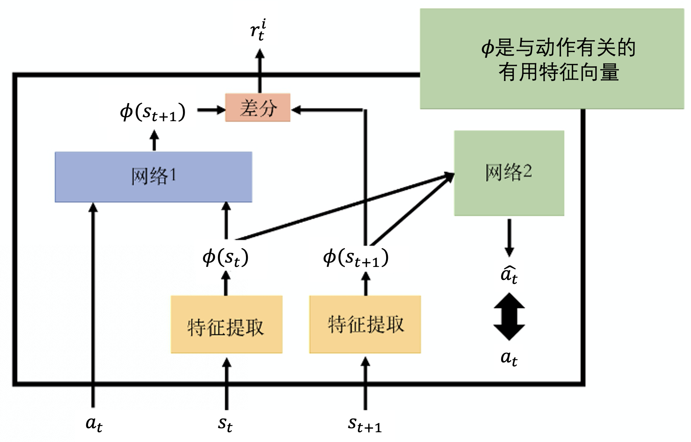
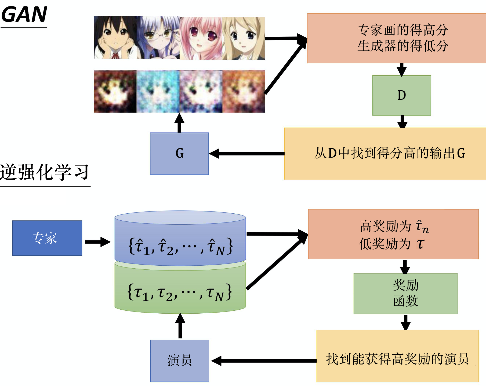
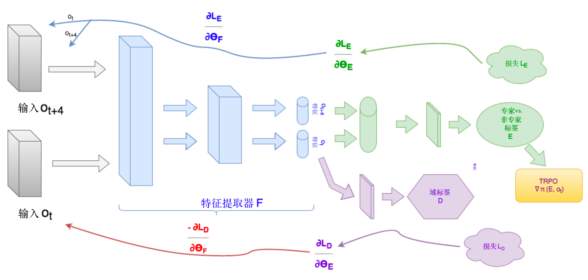

# 稀疏奖励

假设要训练一个机械臂，桌上有一个螺丝钉个螺丝起子，要让机械臂用起子把螺丝钉栓进去。在没栓进去之前，智能体是得不到奖励的，这意味着智能体需要经过非常多次的探索，恰好做到了我们的目标才能得到奖励，这完全是一种偶然事件。这就是**稀疏奖励**面对的问题

## 设计奖励

用领域知识去设计奖励函数。比如越靠近起子奖励越大，螺丝栓越紧奖励越大。

## 好奇心模块 ICM

给智能体加上好奇心奖励，网络1输入状态 $s_{t}$ 在这个状态采取的动作 $a_{t}$ ，以及下一个状态 $s_{t+1}$ ，输出奖励 $r_{t}^{i}$ , $r_{t}^{i}$ 表示预测的状态 $\hat{s_{t+1}}$ 和实际状态 $s_{t+1}$ 的相似度，越不相似得到的奖励越大，鼓励智能体去冒险。网络2用于提取状态中真正和动作有关的特征，输入向量 $\phi(s_{t})$ 和 $\phi(s_{t+1})$ 去预测动作。这个好奇心模块是另外训练出来的，用于产生奖励 ${r_{t}^{i}}$

## 课程学习

课程学习指我们为智能体的学习做规划，给他的数据是有顺序的，并不是一上来就让智能体从零开始学习。
### 逆向课程生成学习

从目标状态反推，一步步的增大学习的难度。比如让机械臂抓取某个东西，先从很近的地方开始，再一步步的拉远距离。

## 分层强化学习(HRL)

将一个复杂的强化学习问题分解为多个小的简单的子问题，每个子问题可以用马尔科夫决策过程建模。将智能体的策略分为高层次策略和低层次策略，就是多Agent的协同

# 模仿学习

收集专家的示范，智能体模仿这些示范进行学习。介绍俩个方法：**行为克隆(BC)**和**逆强化学习(IRL)**

## 行为克隆

例如采集专家在一系列状态下的动作 $(s_1,a_1),(s_2,a_2),(s_3,a_3),\ldots$ ，训练一个演员 $\pi(s)$ 去学习这些数据。

不过有个问题是，这样观测到的数据是极其有限的，当智能体遇到数据中不存在的情形，那么做出的动作很可能是我们无法接受的。可以结合另一个方法数据集聚合解决，就是当 $\pi(s)$ 是没遇到的情形时，同时让专家一同做出动作，以完善数据不足问题。

## 逆强化学习

逆强化学习也没有奖励，只有专家的示范，智能体是可以和环境交互的，但是智能体无法从环境得到奖励，而必须从专家哪里推出来，也就是通过专家的示范反推奖励函数。

专家 $\hat{\theta}$ 与环境交互得到 N 个轨迹, 演员$\theta$ 与环境交互也得到 N 个轨迹，对这些轨迹训练奖励函数，要让专家的奖励大于演员的奖励，并且在迭代后演员的奖励能追上专家的奖励。这个奖励函数是有限制的，当是线性函数时可以证明收敛。

逆强化学习和 GAN 其实是一样的，生成器就是演员，判别器就是奖励函数

## 第三人称视角模仿学习

也是一种生成对抗网络技术，希望学习一个特征提取器，智能体在第三人称的时候与它在第一人称的时候的视角其实是一样的，就是把最重要的东西抽出来就好了。

## 序列生成和聊天机器人

把逆强化学习技术应用到序列生成任务中，让机器人学会人类的语言模式等等。